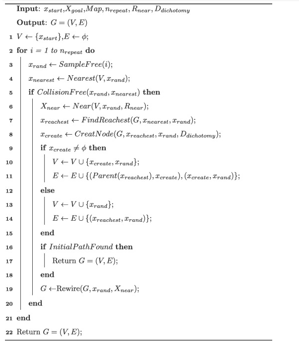

# Fast-RRT* Global Path Planner

ROS Global Path Planner Plugin implementation of the [Fast-RRT* algorithm](https://doi.org/10.1016/j.eswa.2021.115457) for [move_base](http://wiki.ros.org/move_base).

- [Fast-RRT\* Global Path Planner](#fast-rrt-global-path-planner)
  - [Pseudocode](#pseudocode)
  - [ROS](#ros)
    - [Publisher List](#publisher-list)
    - [Parameter List](#parameter-list)
      - [Global Planner](#global-planner)
      - [Global Costmap](#global-costmap)
  - [Quick Start Guide](#quick-start-guide)
    - [Important Locations Inside Container](#important-locations-inside-container)
    - [Running Simulation](#running-simulation)
      - [Terminal 1: Gazebo](#terminal-1-gazebo)
      - [Terminal 2: RViz](#terminal-2-rviz)
        - [Suggested RViz Settings](#suggested-rviz-settings)
      - [Terminal 3: Navigation](#terminal-3-navigation)
      - [Recording Activity](#recording-activity)
  - [License](#license)

## Pseudocode

Fast-RRT* is more optimal than its predecessors RRT and RRT* through its novel method of creating an additional node when planning around obstacles. 

The node placement draws upon the observation that paths that traverse closer to obstacles in the environment tend to be shorter, or more optimal, overall. 

Check out the [documentation file](./docs/Fast_RRTdocumentation.md) for an in depth explanation of how the Fast-RRT* functions work.

## ROS

The Fast-RRT* code is a plugin to the `global_planner` in the [move_base](http://wiki.ros.org/move_base) navigation stack.

This has been tested on the following ROS 1 distributions:

- [ROS Noetic Ninjemys (Ubuntu 20.04)](http://wiki.ros.org/noetic)
   - [Husky Noetic Documentation](https://www.clearpathrobotics.com/assets/guides/noetic/husky/)

### Publisher List

`~<name>/plan` (nav_msgs/Path): Last plan computed, published every time the planner computes a new path

### Parameter List

#### Global Planner 

- `int max_num_iter_`: Maximum number of iterations to search for path
- `int min_num_iter_`: Minimum number of iterations to search for path
- `world_coords world_near_radius_`: Search radius (in world coordinates)
- `world_coords world_dist_dichotomy_`:  Dichotomy distance (in world coordinates), the minimum allowable distance between nodes created in CreateNode
- `world_coords world_goal_accessible_dist_`: Threshold for considering goal position to be accessible from current position
- `world_coords world_expand_dist_`: Maximum distance to expand tree when adding new nodes
- `double goal_frequency_`: Frequency of random node being set to goal node

#### Global Costmap

- `map_cost lethal_cost_`: Cost at which to consider a cell inaccessible

## Quick Start Guide

We have containerized our planner to make testing quick and easy. Due to the use of GUI applications, there may be some additional setup required beyond just [installing Docker](https://docs.docker.com/get-docker/).

- Linux
   - Allow X forwarding with `xhost +`
- Windows 10/11
   - We suggest using [Windows Subsystem for Linux](https://learn.microsoft.com/en-us/windows/wsl/install) and [WSLg](https://github.com/microsoft/wslg) for GUI support
- MacOS
  - Untested

Once you have setup Docker and a way of displaying GUI applications running inside a Docker container, **check the sections below**.

Next, build the docker image and run the container with the included bash script: `./docker/build_and_run_docker.bash`. **NOTE**: Do not run this script from the `docker` folder.

Assuming nothing went wrong you should now be inside the husky image container.

### Important Locations Inside Container

There are two important locations inside the container - `/opt/ros/$ROS_DISTRO` where all the ros debian packages such as the husky stack are installed and `/root/catkin_ws` which contains any source packages.

`/root/catkin_ws` contains a `scripts` and a `src` folder. The former contains scripts for running Gazebo, Rviz, and the planner in various modes. The latter contains the source code for the Fast-RRT* planner which was copied into the image.

Other than the planner source code, you can also modify the husky description and navigation launch files found in `/opt/ros/$ROS_DISTRO/share/husky_description` and `/opt/ros/$ROS_DISTRO/share/husky_navigation` respectively. Modified versions are included in the [docker](./docker/) folder and are copied into the image when the [Dockerfile](./docker/Dockerfile) is built by [build_and_run_docker.bash](./docker/build_and_run_docker.bash).

The [Fast-RRT* planner configuration file](./config/planner.yaml) is copied into the appropriate location in the image as specified in the [Dockerfile](./docker/Dockerfile). This has parameters that control the behavior of the planner and should be adjusted before running the docker container.

The [husky description](./docker/husky_description/urdf/husky.urdf.xacro) was modified from the default to enable the LiDAR sensor.

The [husky navigation launch files](./docker/husky_navigation/) were modified to use our Fast-RRT* global planner instead of the default and to allow for debugging with valgrind if desired.

### Running Simulation

To actually run the sim, you will need at least three terminal sessions. feel free to use `tmux` or `screen` if you're comfortable with those utilities. Otherwise you can connect to the container using additional terminals and running `docker exec -it <container_id> bash`. Use `docker ps` to see running containers and their IDs.

**NOTE:** The following scripts should be run from the `/root/catkin_ws/` directory inside the docker container, which you should be in by default (i.e., run `./scripts/<script_name>` and not `cd scripts && ./<script_name>`).

#### Terminal 1: Gazebo

In the first bash session, execute the first script: `./scripts/1_gazebo.bash`

#### Terminal 2: RViz

In the second bash session, execute the second script: `./scripts/2_rviz.bash`

##### Suggested RViz Settings

- Disable **Odometry**
- Enable **Navigation**
- Disable **Local Costmap**
- Expand **Global Plan** by clicking on the arrow to the left
   - After running the navigation node (see terminal 3), adjust **Topic**:
      - Fast-RRT*: `/move_base/DWAPlannerROS/global_plan`
      - Default: `/move_base/NavfnROS/plan`

#### Terminal 3: Navigation

In the third bash session, execute the third script corresponding to the option you want:

- Fast-RRT*
   - Release: `./scripts/3_fast_rrt_star.bash`
   - Debug: `./scripts/3_fast_rrt_star_debug.bash`
   - Debug with Valgrind: `./scripts/3_fast_rrt_star_debug_valgrind.bash`
- `move_base` Default
   - `./scripts/3_default.bash`

#### Recording Activity

A gazebo instance with a husky in it and an rviz instance should open. You should also check that the third terminal has not crashed before proceeding.

If you wish to record your current activity you can use the command `rosbag record --topics <topic1> <topic2> <topic3> .....` to do so. You can also make a standardized bash script to make this easier.

Once you've confirmed everything is working and started your bag, select the 2d nav goal in rviz and place a goal down where you'd like the robot to move. If your planner is working correctly you'll see a green line from the robot to the goal that doesn't intersect obstacles. If you don't see that happen then it is time to debug.

## License

This work is published under the MIT License. Please see [LICENSE](./LICENSE) for details.

APPROVED FOR PUBLIC RELEASE. CASE NUMBER: 22-3318