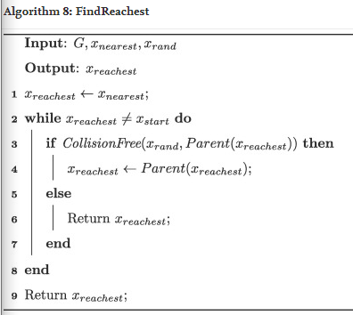
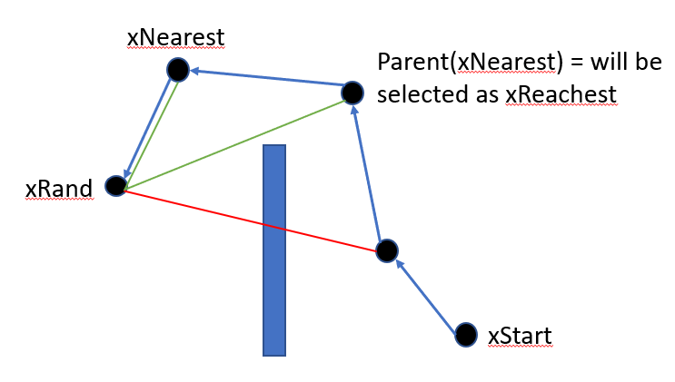
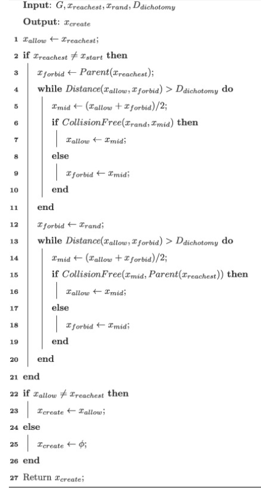
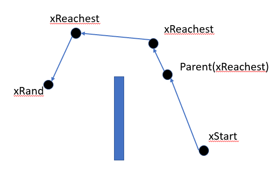
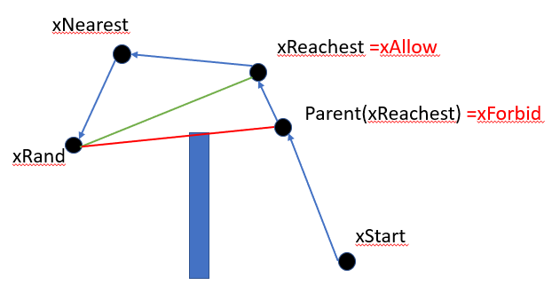
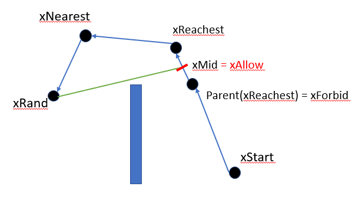
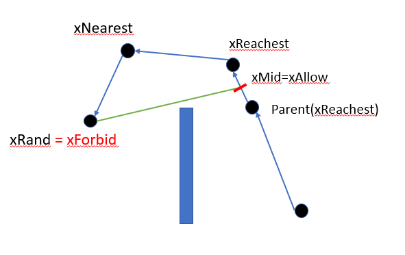
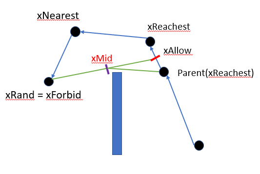
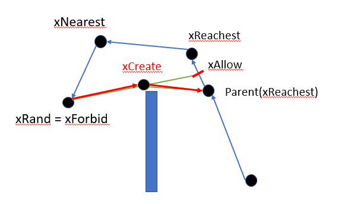
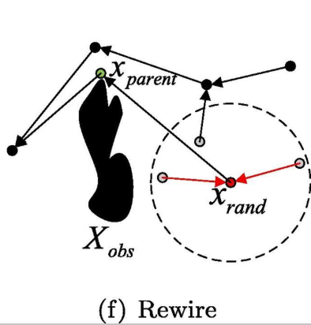

# Fast-RRT* Documentation

- [Fast-RRT* Documentation](#Fast-RRT-documentation)
  - [`FindReachest()`](#findreachest)
    - [Psuedo Code](#psuedo-code)
    - [Written Explanation](#written-explanation)
    - [Visual](#visual)
  - [`CreateNode()`](#createnode)
    - [Psuedo Code](#psuedo-code-1)
    - [Written Explanation](#written-explanation-1)
    - [Visual](#visual-1)
  - [`Rewire()`](#rewire)
    - [Written Explanation](#written-explanation-2)
    - [Visual](#visual-2)
  - [`SampleFree()`](#samplefree)
  - [`Nearest()`](#nearest)
  - [`Near()`](#near)

## `FindReachest()`

### Psuedo Code

### Written Explanation

Find the furthest possible node of `xNearest`'s parents from `xRand` that does not have an obstacle when a straight line is drawn between them.

The selected node `xReachest` must be chosen from `xNearest`'s ancestors. The starting node may not be selected as `xReachest`.

### Visual

## `CreateNode()`

### Psuedo Code

### Written Explanation

Creates a node (`xCreate`) based on `xRand`, `xReachest`, and parent (`xReachest`) locations such that the path is drawn more near to the obstacle in few steps. Remember that these two nodes are guaranteed to have an obstacle between them.

The node is created between `xRand` and `xReachest` where the path between `xRand` and `xCreate` becomes free of all obstacles.

### Visual

<figure>
  
  
  <figcaption> 1) xAllow and xForbid are set </figcaption>
</figure>

<figure>
  
  <figcaption> 2) xMid is established between xAllow and xForbid when the path is collision free to xRand</figcaption>
</figure>

<figure>
  
  
  <figcaption> 3) xMid is the new xAllow and xRand is the new xForbid</figcaption>
</figure>

<figure>
  
  <figcaption> 4) a new xMid is established between xAllow and xForbid </figcaption>
</figure>

<figure>
  
  <figcaption> 4) a new xMid is established between xAllow and xForbid when collision free to parent(xReachest) </figcaption>
</figure>

## `Rewire()`

### Written Explanation

Changes connection relationships of tree vertices.
For any point in `xNear`, if replacing its parent node to be `xRand` reduces the cost of the path from `xStart` to `xNear`, then replace it.

### Visual

## `SampleFree()`

Returns a sample `xRand` that is selected randomly from xFree.

## `Nearest()`

Nearest vector to `xRand` in terms of Euclidean distance.

## `Near()`

Return the set of vectors contained in specific radius around `xRand`.
